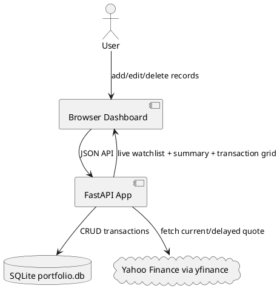
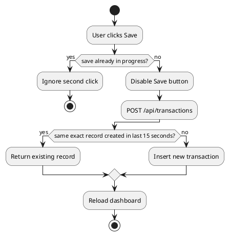

# SPEC-1-Share Portfolio Dashboard

## Background

The user previously tracked share purchases in Excel with `GOOGLEFINANCE()` formulas. The revised MVP is a mini web app that stores records directly in SQLite, fetches market prices online, and shows both a live watchlist and a summary of purchased shares.

## Requirements

### Must Have

- No Excel or CSV dependency.
- Add new share purchase records from the dashboard.
- Edit and delete existing records.
- Date field uses a date selector.
- Share code is selected from a dropdown and remains changeable after selection.
- Default live dashboard shows: NVDA, ORCL, GOOGL, NU, GRAB, TSM, HROW, SAIL, TLX, META, MSFT, AVGO, GLDM.
- Columns: date, share code, investment amount, purchase units, average price, current market price, current value, total earn/loss.
- Show summary dashboard grouped by share code.
- Prevent accidental double-save from double-clicks.

### Should Have

- API endpoints for future mobile or frontend integration.
- Docker deployment support.
- Cache market prices to avoid excessive external calls.

### Could Have

- Login/password protection.
- Broker import.
- Multi-currency conversion.
- Custom editable watchlist management.

### Won't Have in MVP

- Trading/broker execution.
- Official paid market data feed.
- Direct Google Sheets formula execution.

## Method

SQLite stores user-entered records. Market prices are fetched at request time through `yfinance`, with a direct Yahoo Finance chart fallback, and cached for 5 minutes. Google Finance-style symbols are normalized to Yahoo-style symbols before lookup.



### Database Schema

```sql
CREATE TABLE transactions (
    id INTEGER PRIMARY KEY AUTOINCREMENT,
    purchase_date TEXT NOT NULL,
    symbol TEXT NOT NULL,
    investment_amount REAL NOT NULL CHECK (investment_amount > 0),
    purchase_units REAL NOT NULL CHECK (purchase_units > 0),
    created_at TEXT NOT NULL,
    updated_at TEXT NOT NULL
);
```

### Calculations

```text
average_price = investment_amount / purchase_units
current_value = current_market_price * purchase_units
total_earn = current_value - investment_amount
return_pct = total_earn / investment_amount * 100
```

### Accidental Double-Save Protection



## Implementation

1. Install Python dependencies.
2. Start FastAPI.
3. SQLite database is auto-created.
4. Dashboard loads default live market watchlist.
5. User adds purchase records through the form.
6. Summary dashboard groups purchases by share code and calculates earn/loss.
7. Transaction grid supports edit and delete.

## Milestones

- M1: Live default watchlist
- M2: CRUD transaction grid
- M3: Holdings summary dashboard
- M4: Double-save protection
- M5: Docker deployment

## Gathering Results

Verify that records persist, dropdown values can be changed during add/edit, double-clicking save creates only one record, market prices load for valid symbols, and total earn/loss matches manual calculation.

## Need Professional Help in Developing Your Architecture?

Please contact me at [sammuti.com](https://sammuti.com) :)
