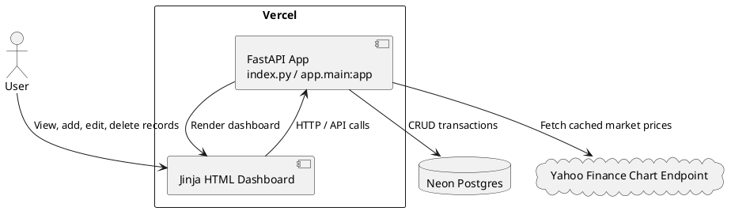

# SPEC-2-share-portfolio-dashboard-vercel-neon

## Background

The original portfolio tracker used an Excel-style workflow and later a local SQLite web app. The new requirement is to host the dashboard online with one stable URL while keeping data persistent across deployments.

## Requirements

### Must Have

- Host the web dashboard on Vercel with one stable production URL.
- Store share purchase records in Neon Postgres.
- Allow adding, editing, and deleting purchase records from the dashboard.
- Show a live market dashboard for the user’s common symbols: NVDA, ORCL, GOOGL, NU, GRAB, TSM, HROW, SAIL, TLX, META, MSFT, AVGO, GLDM.
- Show share summary by code: total invested, units, average price, current value, total earn/loss, and return %.
- Support common Google Finance-style symbols and convert them to Yahoo-style lookup symbols.

### Should Have

- Password protect the public URL.
- Cache quote calls to reduce slow page loads and external quote requests.
- Provide migration from older local SQLite data to Neon.

### Could Have

- User accounts.
- Broker import.
- Historical performance chart.

### Won’t Have in MVP

- Real-time trading.
- Official broker-grade price feed.
- Tax reporting.

## Method

### Architecture



### Database Schema

```sql
CREATE TABLE IF NOT EXISTS transactions (
    id BIGSERIAL PRIMARY KEY,
    purchase_date DATE NOT NULL,
    symbol TEXT NOT NULL,
    investment_amount NUMERIC(18, 6) NOT NULL CHECK (investment_amount > 0),
    purchase_units NUMERIC(18, 6) NOT NULL CHECK (purchase_units > 0),
    created_at TIMESTAMPTZ NOT NULL DEFAULT NOW(),
    updated_at TIMESTAMPTZ NOT NULL DEFAULT NOW()
);

CREATE INDEX IF NOT EXISTS idx_transactions_symbol ON transactions(symbol);
CREATE INDEX IF NOT EXISTS idx_transactions_date ON transactions(purchase_date);
```

### Portfolio Calculation

For each transaction:

```text
average_price = investment_amount / purchase_units
current_value = current_market_price * purchase_units
total_earn = current_value - investment_amount
return_percent = total_earn / investment_amount * 100
```

For each holding summary:

```text
total_invested = sum(investment_amount)
total_units = sum(purchase_units)
average_price = total_invested / total_units
current_value = current_market_price * total_units
total_earn = current_value - total_invested
return_percent = total_earn / total_invested * 100
```

### Symbol Conversion

```text
NASDAQ:NVDA  -> NVDA
NYSE:ORCL    -> ORCL
HKG:0700     -> 0700.HK
SGX:D05      -> D05.SI
KLSE:MAYBANK -> MAYBANK.KL
TLX          -> TLX.AX
```

## Implementation

1. Create Neon project and copy the connection string.
2. Set Vercel environment variables:
   - DATABASE_URL
   - BASIC_AUTH_USERNAME
   - BASIC_AUTH_PASSWORD
   - PRICE_CACHE_SECONDS
3. Deploy the FastAPI app to Vercel.
4. On first request, the app creates the Postgres table if it does not exist.
5. User adds purchases through the dashboard.
6. App calculates summary and current value on every dashboard load, using cached quote calls.

## Milestones

1. Neon database created.
2. Vercel project deployed.
3. Health check returns `database: postgres`.
4. Add/edit/delete record works.
5. Summary dashboard matches expected manual calculations.
6. Optional old SQLite data migrated into Neon.

## Gathering Results

- Confirm `/healthz` shows `status: ok`.
- Add a test record and confirm it remains after a Vercel redeploy.
- Compare calculated average price and total earn/loss against manual spreadsheet formulas.
- Confirm market prices load for all configured watchlist symbols.
- Confirm Basic Auth is enabled before sharing the URL.

## Need Professional Help in Developing Your Architecture?

Please contact me at [sammuti.com](https://sammuti.com) :)
